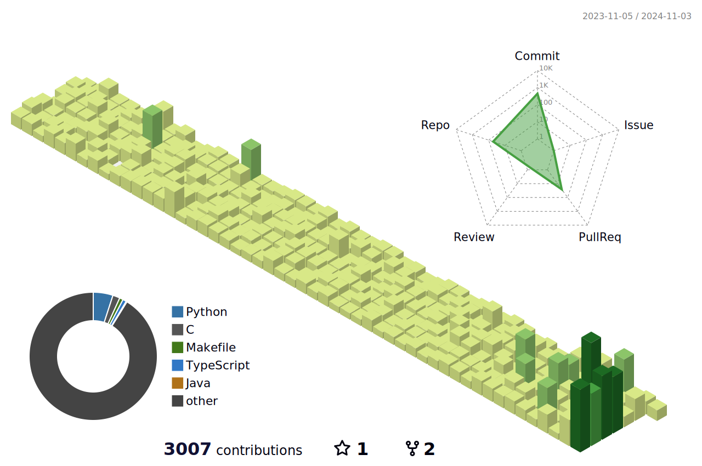

<html>
<head>

</head>
<body class="flex flex-col items-center h-dvh">
<header>
<!-- Image -->

</header>
<main>
<h3>Languages and Tools:</h3>
<table cellpadding="8" cellspacing="0" style="border: none; border-collapse: collapse">
<tr style="border: none">
<td style="border: none">

</td>
<td style="border: none">

</td>
<td style="border: none">

</td>
<td style="border: none">

</td>
<td style="border: none">

</td>
<td style="border: none">

</td>
<td style="border: none">

</td>
<td style="border: none">

</td>
<td style="border: none">

</td>
<td style="border: none">

</td>
<td style="border: none">

</td>
<td style="border: none">

</td>
<td style="border: none">

</td>
<td style="border: none">

</td>
<td style="border: none">

</td>
<td style="border: none">

</td>
<td style="border: none">

</td>
<td style="border: none">

</td>
</tr>
<tr>
<td style="border: none">

</td>
<td style="border: none">

</td>
<td style="border: none">

</td>
<td style="border: none">

</td>
<td style="border: none">

</td>
<td style="border: none">

</td>
<td style="border: none">

</td>
<td style="border: none">

</td>
<td style="border: none">

</td>
<td style="border: none">

</td>
<td style="border: none">

</td>
<td style="border: none">

</td>
<td style="border: none">

</td>
<td style="border: none">

</td>
<td style="border: none">

</td>
<td style="border: none">

</td>
<td style="border: none">

</td>
<td style="border: none">

</td>
</tr>
<tr style="border: none">
<td style="border: none">

</td>
<td style="border: none">

</td>
<td style="border: none">

</td>
<td style="border: none">

</td>
<td style="border: none">

</td>
<td style="border: none">

</td>
<td style="border: none">

</td>
<td style="border: none">

</td>
<td style="border: none">

</td>
<td style="border: none">

</td>
<td style="border: none">

</td>
<td style="border: none">

</td>
<td style="border: none">

</td>
<td style="border: none">

</td>
<td style="border: none">

</td>
</tr>
</table>
<h3 class="mt-4 mb-4">Profile views </h3>
<iframe frameborder="0" src="https://count.getloli.com/get/@cowanweks.github.readme"></iframe>
<h3 class="mt-4 mb-4">Profile Statistics</h3>

<!-- Projects in progress -->

<h3 class="mt-4 mb-4">Am Currently Working On</h3>
<table cellpadding="28" cellspacing="0">
<tr style="border: none">
<td style="border: none">
<video src=""></video>
</td>
<td style="border: none">
              Key Manager
            </td>
<td style="border: none"><a class="text-blue-500" href="https://github.com/cowanweks/keyman" target="_blank">View</a></td>
</tr>
<tr style="border: none">
<td style="border: none">
<video src=""></video>
</td>
<td style="border: none">Ultimate Motors</td>
<td style="border: none"><a class="text-blue-500" href="https://github.com/cowanweks/ultimate-motors" target="_blank">View</a></td>
</tr>
</table>

</main>
<footer>

<!--  -->
</footer>
</body>
</html>